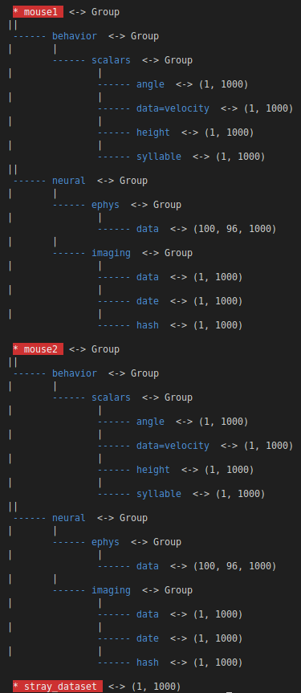

# drawh5: visualize .h5 files structure  
### Quickly visualize the entire structure of h5 files with information about dataset sizes and group relationships. This is a useful tool especially when using large h5 files.

## Example output:

